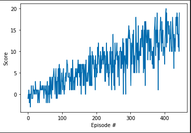

# Report Project 1: Navigation

## By: Alex Wong

### Introduction

This report explains the algorithm behind the agent trained to collect bananas and the results of training.

### Learning Algorithm

A double Q network is used to solve the environment. The following paragraphs explains how the agent learns.

The agent trains for `n_episodes` number of episodes and each episode is capped at `tmax` steps to ensure that an episode stops. For each step the agent acts by selecting the epsilon greedy action. During the step the agent adds the current `state`, `action`, `reward`, `next_state` and `done` to its memory.

The agent learns every `UPDATE_VERY` time steps. It samples a batch of experiences from memory to learn. Each batch of experiences contains the vectors `states`, `actions`, `rewards`, `next_states` and `dones`. A double Q network has two neural networks `qnetwork_target` and `qnetwork_local`. This is done to stabilize training as it is hard for the network to train on a 'moving' target. The use of these networks are explained in more detail in the following paragraphs.

The vector `next_states` is forward propagated through the `qnetwork_target` neural network to obtain the maximum of the predicted Q values for the next states `Q_targets_next`. The Q values for the current states `Q_targets` are computed with `rewards + gamma * Q_targets_next * (1 - dones)`. The `gamma` parameter discounts the future Q values to place less emphasis on the future.

After computing `Q_targets`, we compute `Q_expected` by forward propagating the vector `states` through the neural network `qnetwork_local` and collecting the Q values based on the vector `actions`. Now we have `Q_targets` and `Q_expected` and we can compute the mean squared error loss and update the weights of `qnetwork_local` through backpropgation. We perform a soft update on the weights of `qnetwork_target`, the `tau` parameters controls how much of the current weights of `qnetwork_target` are kept and how much from `qnetwork_local` is copied over. 

The neural network has 3 fully connected layers. The layers each have `64` activation units and a `relu` activation function is used to connect the layers. The input layer takes in the states and propagates them through the network. The output layer returns the Q values for the respective actions.

The values for all the hyperparameters are:

```
BUFFER_SIZE = int(1e5)  # replay buffer size
BATCH_SIZE = 64         # minibatch size
GAMMA = 0.99            # discount factor
TAU = 1e-3              # for soft update of target parameters
LR = 5e-4               # learning rate 
UPDATE_EVERY = 4        # how often to update the network
```

### Plots of Rewards

Below is a plot of the reward per episode. The environment was solved in 344 episodes, i.e. an average reward of 13 per 100 episodes was reached in 344 episodes.



### Ideas for Future Work

The learning algorithm could be improved by:
* Try different hyperparameters:
    * Try different values for `LR`, the learning rate of the neural network.
    * Try different values for the discount factor `gamma`.
    * Try different update schemes for `eps` (epsilon) with different values for `eps_end` and `eps_decay`.
* Try different architecture for the neural networks:
    * Try different activation functions (e.g. sigmoid and leaky ReLU).
    * Try different number of layers and number of activation units in the neural networks.
* Prioritized Experience Replay: do not uniformly sample from the memory, but place higher probabilties on important experiences.
* Dueling DQN: a dueling architecture allows you to asses the value of each state, without having to learn the effect of each action.